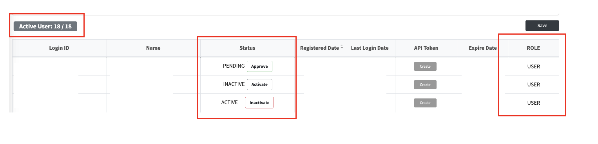

# User Management

관리자 메뉴에서 사용자 상태와 권한을 관리하는 방법을 안내드립니다.

## 접속 방법

User Management 메뉴는 사용자 정보를 확인할 수 있는 메뉴로 접근시 비밀번호 입력이 필요합니다.
비밀번호는 LG Open Source Program Office에게 문의하시길 바랍니다.

## Active User

사용자 목록 상단에서 현재 활성화된 사용자 수와 활성화할 수 있는 전체 사용자 수를 확인할 수 있습니다.

**Active User: 현재 active된 user 수 / active 가능한 총 user 수**

## Status

`Status`에는 다음 세 가지 상태가 표시될 수 있습니다.

- `ACTIVE`: 사용자가 활성화된 상태
- `INACTIVE`: 사용자가 비활성화된 상태
- `PENDING`: 사용자 등록 대기인 상태

현재 Status의 옆 버튼을 사용하여 사용자의 활성화 여부를 설정할 수 있습니다.

- `ACTIVE` 상태에서 `Inactivate` 버튼을 클릭하면 사용자를 비활성화할 수 있습니다.
- `INACTIVE` 상태에서 `Activate` 버튼을 클릭하면 사용자를 활성화할 수 있습니다.
- `PENDING` 상태에서 `Approve` 버튼을 클릭하면 사용자를 활성화할 수 있습니다.
- 사용자 활성화 시 `Active User`의 현재 활성 사용자 수가 활성화 가능한 총 사용자 수를 초과하지 않는 경우에만 가능합니다.

## Role

`ROLE`에서 사용자의 권한을 다음 중 하나로 선택하여 설정할 수 있습니다.

- `USER`: 일반 사용자 권한
- `MANAGER`: 관리자 권한

권한 또는 사용자 상태를 변경한 후에는 화면 우측 상단의 `Save` 버튼을 클릭하여 변경 내용을 저장합니다.
