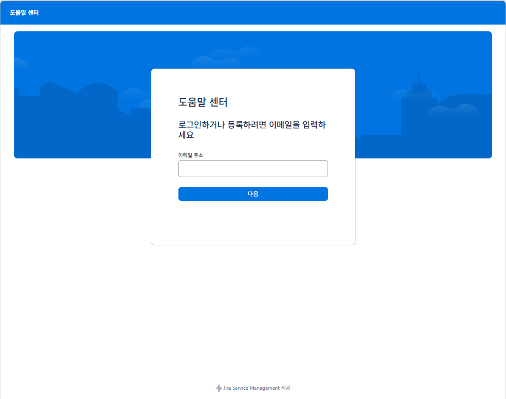

# Sign In & Sign Up
FOSSLight Enterprise Jira 계정 생성 및 로그인 방법을 설명합니다. 
- FOSSLight Enterprise Jira : https://fosslight.atlassian.net/servicedesk/customer/portal/69
  

# Sign Up
{: .left-bar-title }
FOSSLight Enterprise Jira를 처음 이용하는 경우 계정을 생성해야 합니다.  
- FOSSLight Enterprise Jira에 접속합니다.
- 회사 이메일 주소를 입력한 후 다음(Next) 을 선택합니다.
- 입력한 이메일 주소로 발송된 확인 메일을 확인합니다.
- 이름과 비밀번호를 설정합니다.
- 계정 생성이 완료되면 서비스를 이용할 수 있습니다.
 

  

## Sign In 
{: .left-bar-title }
계정 생성이 완료된 후에는 등록한 이메일 주소와 비밀번호를 사용하여 로그인할 수 있습니다.

   
